# Wellfond BMS — Project Architecture Document

**Version:** 1.0.0  
**Last Updated:** 2026-05-07  
**Status:** Single source-of-truth for onboarding developers and coding agents

---

## Table of Contents

1. [Project Overview](#1-project-overview)
2. [Technology Stack](#2-technology-stack)
3. [Architecture Patterns](#3-architecture-patterns)
4. [System Architecture Diagram](#4-system-architecture-diagram)
5. [File Hierarchy](#5-file-hierarchy)
6. [Database Schema (ER Diagram)](#6-database-schema-er-diagram)
7. [Application Flow Diagrams](#7-application-flow-diagrams)
8. [Backend Deep Dive](#8-backend-deep-dive)
9. [Frontend Deep Dive](#9-frontend-deep-dive)
10. [Infrastructure & Deployment](#10-infrastructure--deployment)
11. [Testing Strategy](#11-testing-strategy)
12. [Security Model](#12-security-model)
13. [Development Workflow](#13-development-workflow)
14. [Key Files Reference](#14-key-files-reference)
15. [Glossary](#15-glossary)

---

## 1. Project Overview

### What is Wellfond BMS?

Wellfond BMS (Breeding Management System) is an enterprise web application for **Wellfond Pets Holdings Pte Ltd**, a Singapore-based AVS-licensed dog breeding operation. It manages the full lifecycle of breeding operations: dog records, ground operations, breeding genetics, sales agreements, NParks compliance, customer management, and financial reporting.

### Business Context

- **Market:** Singapore (SGD, 9% GST, Asia/Singapore timezone)
- **Regulatory:** AVS (Animal & Veterinary Service) licensing, NParks monthly reporting, PDPA compliance
- **Entities:** Holdings (parent), Katong (AVS-licensed), Thomson (AVS-licensed)
- **Users:** Management, Admin, Sales, Ground staff, Vet

### Phase Roadmap

| Phase | Domain | Status |
|-------|--------|--------|
| 0 | Infrastructure & Foundation | ✅ Complete |
| 1 | Auth, BFF Proxy & RBAC | ✅ Complete |
| 2 | Domain Foundation (Dog, Health, Vaccines) | ✅ Complete |
| 3 | Ground Operations (Heat, Mate, Whelp, Health Obs) | ✅ Complete |
| 4 | Breeding & Genetics (COI, Saturation, Closure Table) | ✅ Complete |
| 5 | Sales Agreements & AVS Tracking | ✅ Complete |
| 6 | Compliance & NParks Reporting | ✅ Complete |
| 7 | Customer DB & Marketing Blast | ✅ Complete |
| 8 | Dashboard & Finance | ✅ Complete |
| 9 | Observability & Production Readiness | 🔲 Planned |

---

## 2. Technology Stack

### Backend

| Component | Technology | Version | Purpose |
|-----------|-----------|---------|---------|
| Framework | Django | 6.0.4 | Web framework |
| API Layer | Django Ninja | 1.6.2 | REST API with OpenAPI schema |
| Runtime | Python | 3.13 | Language |
| ASGI Server | Uvicorn + Gunicorn | — | Production ASGI |
| Database | PostgreSQL | 17 | Primary data store |
| Connection Pool | PgBouncer | 1.23.0 | Transaction-mode pooling |
| Cache/Sessions | Redis | 7.4 | Split instances (sessions, broker, cache, idempotency) |
| Task Queue | Celery | 5.6.2 | Async tasks + periodic scheduling |
| Task Scheduler | django-celery-beat | 2.9.0 | DB-backed periodic tasks |
| PDF Generation | Gotenberg | 8 | Chromium-based PDF rendering |
| Auth | Custom (HttpOnly cookies + Redis sessions) | — | Cookie-based session management |
| Validation | Pydantic | 2.13.3 | Schema validation via Ninja |

### Frontend

| Component | Technology | Version | Purpose |
|-----------|-----------|---------|---------|
| Framework | Next.js | 16.2.4 | React SSR + BFF proxy |
| Language | TypeScript | 6.0.3 | Type safety |
| UI Library | React | 19.2.5 | Component framework |
| Styling | Tailwind CSS | 4.2.4 | Utility-first CSS |
| Component Primitives | Radix UI | — | Accessible UI components |
| Data Fetching | TanStack Query | 5.100.1 | Server state management |
| State | Zustand | 5.0.12 | Client state (minimal) |
| Animation | Framer Motion | 12.38.0 | Page transitions, micro-interactions |
| Validation | Zod | 4.3.6 | Runtime type validation |
| PWA | Custom service worker | — | Offline support for ground ops |
| Testing | Vitest + Playwright | — | Unit + E2E testing |

### Infrastructure

| Component | Technology | Purpose |
|-----------|-----------|---------|
| Containers | Docker + Docker Compose | Service orchestration |
| Reverse Proxy | Nginx | TLS termination, static assets |
| CI/CD | GitHub Actions | Lint, test, build, scan |
| Security Scanning | Trivy | Container vulnerability scanning |
| Coverage | Codecov | Test coverage tracking |

---

## 3. Architecture Patterns

### 3.1 Backend-for-Frontend (BFF) Pattern

The frontend never communicates directly with Django. All API calls go through Next.js API routes (`/api/proxy/*`) which act as a BFF proxy.

```
Browser → Next.js (BFF) → Django API
         ↑ cookies        ↑ internal URL
         ↑ CSRF token     ↑ not exposed to browser
```

**Why:** Hides backend internals, allows server-side auth token handling, enables request transformation, prevents `BACKEND_INTERNAL_URL` leakage to the browser bundle.

**Key files:**
- `frontend/app/api/proxy/[...path]/route.ts` — BFF proxy handler
- `frontend/lib/api.ts` — Client-side API wrapper (routes through BFF)
- `frontend/next.config.ts` — `BACKEND_INTERNAL_URL` validation

### 3.2 Entity-Based Multi-Tenancy

All domain data is scoped to a business **Entity** (Holdings, Katong, Thomson). Users are assigned a primary entity. The `EntityScopingMiddleware` attaches entity context to every request.

```
User → Entity (FK) → All queries filtered by entity_id
Management role → Sees all entities
Other roles → See only their assigned entity
```

**Key files:**
- `backend/apps/core/models.py` — `Entity` model
- `backend/apps/core/middleware.py` — `EntityScopingMiddleware`
- `backend/apps/core/permissions.py` — `scope_entity()`, `scope_entity_for_list()`

### 3.3 Role-Based Access Control (RBAC)

Five roles with hierarchical permissions:

```
Management (4) > Admin (3) > Sales (2) > Ground (1) = Vet (1)
```

**Key files:**
- `backend/apps/core/models.py` — `User.Role` choices
- `backend/apps/core/permissions.py` — `require_role()`, `RoleGuard`, `PermissionChecker`
- `frontend/lib/auth.ts` — Client-side role checks
- `frontend/middleware.ts` — Edge middleware for route protection

### 3.4 Idempotency Middleware

All state-changing API requests require an `X-Idempotency-Key` header. The middleware uses Redis `SET NX` for atomic locking and caches responses for 24 hours.

**Key files:**
- `backend/apps/core/middleware.py` — `IdempotencyMiddleware`
- `frontend/lib/utils.ts` — `generateIdempotencyKey()`

### 3.5 PDPA Compliance

Singapore's Personal Data Protection Act requires consent tracking. Models with `pdpa_consent` field are automatically filtered by `scope_entity()` — only records with `pdpa_consent=True` are returned.

**Key files:**
- `backend/apps/core/permissions.py` — `enforce_pdpa()` and auto-filter in `scope_entity()`
- `backend/apps/compliance/models.py` — `PDPAConsentLog` (immutable audit trail)

### 3.6 Immutable Audit Trail

Several models enforce append-only semantics at the Python level:
- `AuditLog` — All user actions
- `GSTLedger` — Financial records
- `PDPAConsentLog` — Consent changes
- `CommunicationLog` — Marketing communications
- `NParksSubmission` — Once LOCKED, immutable

**Key files:**
- `backend/apps/core/models.py` — `ImmutableManager`, `ImmutableQuerySet`

### 3.7 Closure Table for Pedigree

The `DogClosure` table stores all ancestor-descendant paths with depth, enabling efficient COI (Coefficient of Inbreeding) calculations using Wright's formula without recursive CTEs.

**Key files:**
- `backend/apps/breeding/models.py` — `DogClosure` model
- `backend/apps/breeding/services/coi.py` — `calc_coi()`, `get_shared_ancestors()`

---

## 4. System Architecture Diagram

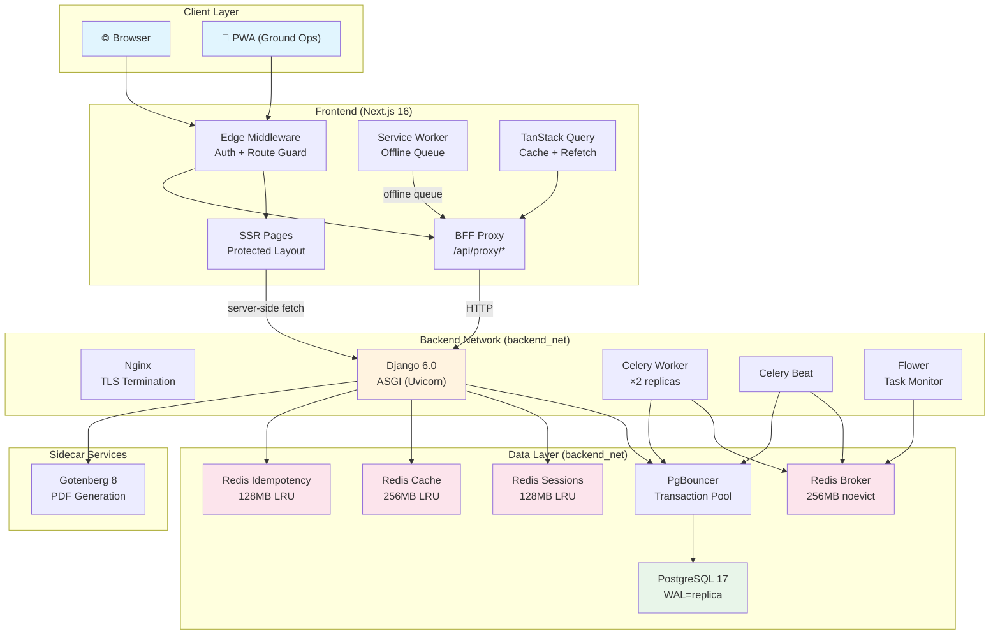

---

## 5. File Hierarchy

```
wellfond-bms/
├── docker-compose.yml              # Production: 11 services
├── .env.example                    # Environment template
├── .env.bak                        # ⚠️ Should be gitignored
├── .gitignore                      # Comprehensive ignore rules
├── pytest.ini                      # Root pytest config
├── conftest.py                     # Root conftest (Django setup)
│
├── backend/                        # ── Django Backend ──
│   ├── manage.py                   # Django CLI entry point
│   ├── Dockerfile.django           # Production multi-stage build
│   ├── requirements/
│   │   ├── base.txt                # Production dependencies
│   │   └── dev.txt                 # Dev dependencies (linters, test tools)
│   │
│   ├── config/                     # ── Django Configuration ──
│   │   ├── settings/
│   │   │   ├── base.py             # Shared settings (DB, Redis, Celery, CSP, logging)
│   │   │   ├── development.py      # Dev overrides (debug toolbar, relaxed CSP)
│   │   │   └── production.py       # Prod hardening (HSTS, secure cookies, env validation)
│   │   ├── urls.py                 # Root URL config (health, admin, API v1)
│   │   ├── celery.py               # Celery app + beat schedule
│   │   ├── asgi.py                 # ASGI application
│   │   └── wsgi.py                 # WSGI application (fallback)
│   │
│   ├── api/                        # ── API Layer ──
│   │   ├── __init__.py             # NinjaAPI instance + router registration
│   │   └── urls.py                 # URL patterns (delegates to api)
│   │
│   └── apps/                       # ── Django Apps (Domain Modules) ──
│       ├── core/                   # Auth, Users, Entity, AuditLog
│       │   ├── models.py           # User, Entity, AuditLog
│       │   ├── auth.py             # SessionManager, AuthenticationService
│       │   ├── permissions.py      # RBAC decorators, scope_entity()
│       │   ├── middleware.py        # Idempotency, EntityScoping, Auth
│       │   ├── schemas.py          # Pydantic schemas for API
│       │   ├── routers/
│       │   │   ├── auth.py         # Login, logout, refresh, CSRF
│       │   │   ├── users.py        # User CRUD
│       │   │   └── dashboard.py    # Dashboard metrics
│       │   └── tests/              # 16 test files
│       │
│       ├── operations/             # Dog, Health, Vaccines, Ground Logs
│       │   ├── models.py           # Dog, HealthRecord, Vaccination, 7 ground log models
│       │   ├── schemas.py
│       │   ├── routers/
│       │   │   ├── dogs.py         # Dog CRUD + search
│       │   │   ├── health.py       # Health records + vaccinations
│       │   │   ├── logs.py         # Ground log CRUD (7 log types)
│       │   │   ├── alerts.py       # Alert aggregation
│       │   │   └── stream.py       # SSE real-time alerts
│       │   ├── services/
│       │   │   ├── alerts.py       # Alert generation logic
│       │   │   ├── draminski.py    # Draminski DOD2 interpretation
│       │   │   ├── vaccine.py      # Vaccine due date calculation
│       │   │   ├── importers.py    # CSV/data importers
│       │   │   └── log_creators.py # Ground log creation helpers
│       │   ├── tasks.py            # Celery tasks (7 tasks)
│       │   └── tests/
│       │
│       ├── breeding/               # Breeding & Genetics (Phase 4)
│       │   ├── models.py           # BreedingRecord, Litter, Puppy, DogClosure, MateCheckOverride
│       │   ├── schemas.py
│       │   ├── routers/
│       │   │   ├── mating.py       # Mate check (COI + saturation)
│       │   │   └── litters.py      # Litter + puppy CRUD
│       │   ├── services/
│       │   │   ├── coi.py          # COI calculator (Wright's formula)
│       │   │   └── saturation.py   # Farm saturation calculator
│       │   └── tests/
│       │
│       ├── sales/                  # Sales & AVS (Phase 5)
│       │   ├── models.py           # SalesAgreement, AgreementLineItem, AVSTransfer, Signature, TCTemplate
│       │   ├── schemas.py
│       │   ├── routers/
│       │   │   ├── agreements.py   # Agreement CRUD + PDF
│       │   │   └── avs.py          # AVS transfer tracking
│       │   ├── services/
│       │   │   ├── agreement.py    # Agreement business logic
│       │   │   ├── avs.py          # AVS notification service
│       │   │   └── pdf.py          # PDF generation via Gotenberg
│       │   ├── templates/sales/    # HTML templates for PDF
│       │   ├── tasks.py
│       │   └── tests/
│       │
│       ├── compliance/             # NParks, GST, PDPA (Phase 6)
│       │   ├── models.py           # NParksSubmission, GSTLedger, PDPAConsentLog
│       │   ├── schemas.py
│       │   ├── routers/
│       │   │   ├── nparks.py       # NParks submission CRUD
│       │   │   ├── gst.py          # GST ledger queries
│       │   │   └── pdpa.py         # PDPA consent management
│       │   ├── services/
│       │   │   ├── nparks.py       # NParks report generation
│       │   │   ├── gst.py          # GST calculation
│       │   │   └── pdpa.py         # PDPA consent service
│       │   ├── tasks.py
│       │   └── tests/
│       │
│       ├── customers/              # Customer DB & Marketing (Phase 7)
│       │   ├── models.py           # Customer, CommunicationLog, Segment
│       │   ├── schemas.py
│       │   ├── routers/
│       │   │   └── customers.py    # Customer CRUD + blast
│       │   ├── services/
│       │   │   ├── blast.py        # Marketing blast engine
│       │   │   └── segmentation.py # Segment filter evaluation
│       │   ├── tasks.py
│       │   └── tests/
│       │
│       ├── finance/                # Finance & Reporting (Phase 8)
│       │   ├── models.py           # Transaction, IntercompanyTransfer, GSTReport, PNLSnapshot
│       │   ├── schemas.py
│       │   ├── routers/
│       │   │   └── reports.py      # Finance reports + exports
│       │   ├── services/
│       │   │   ├── pnl.py          # P&L calculation
│       │   │   └── gst_report.py   # GST report generation
│       │   └── tests/
│       │
│       └── ai_sandbox/             # Phase 9: AI features (placeholder)
│
├── frontend/                       # ── Next.js Frontend ──
│   ├── package.json                # Dependencies + scripts
│   ├── next.config.ts              # BFF proxy, image config, security headers
│   ├── middleware.ts               # Edge auth + route protection
│   ├── tsconfig.json
│   ├── tailwind.config.ts
│   ├── vitest.config.ts
│   ├── playwright.config.ts
│   ├── Dockerfile.nextjs           # Production multi-stage build
│   │
│   ├── app/                        # ── Next.js App Router ──
│   │   ├── layout.tsx              # Root layout (AuthInitializer)
│   │   ├── page.tsx                # Root redirect → /dashboard
│   │   ├── globals.css             # Global styles + CSS variables
│   │   │
│   │   ├── (auth)/                 # ── Auth Routes (public) ──
│   │   │   ├── layout.tsx
│   │   │   └── login/page.tsx
│   │   │
│   │   ├── (protected)/            # ── Protected Routes (auth required) ──
│   │   │   ├── layout.tsx          # Sidebar + Topbar + RoleBar
│   │   │   ├── dashboard/
│   │   │   │   ├── layout.tsx
│   │   │   │   └── page.tsx        # KPIs, alerts, activity feed
│   │   │   ├── dogs/
│   │   │   │   ├── page.tsx        # Dog list with filters
│   │   │   │   ├── [id]/page.tsx   # Dog detail
│   │   │   │   └── dog-filters-client.tsx
│   │   │   ├── breeding/
│   │   │   │   ├── page.tsx        # Breeding overview
│   │   │   │   └── mate-checker/page.tsx  # COI calculator
│   │   │   ├── sales/
│   │   │   │   ├── page.tsx        # Agreement list
│   │   │   │   └── new/page.tsx    # Agreement wizard
│   │   │   ├── compliance/
│   │   │   │   ├── page.tsx        # NParks + GST
│   │   │   │   └── settings/page.tsx
│   │   │   ├── customers/page.tsx  # Customer DB + blast
│   │   │   └── finance/page.tsx    # P&L + GST reports
│   │   │
│   │   ├── (ground)/               # ── Ground Ops Routes (mobile PWA) ──
│   │   │   ├── layout.tsx          # Mobile-optimized dark layout
│   │   │   ├── page.tsx            # Ground home
│   │   │   ├── heat/page.tsx       # Draminski heat tracking
│   │   │   ├── mate/page.tsx       # Mating records
│   │   │   ├── whelp/page.tsx      # Whelping records
│   │   │   ├── health/page.tsx     # Health observations
│   │   │   ├── weight/page.tsx     # Weight tracking
│   │   │   ├── nursing/page.tsx    # Nursing flags
│   │   │   └── not-ready/page.tsx  # Not-ready status
│   │   │
│   │   └── api/proxy/              # ── BFF Proxy (Next.js API Routes) ──
│   │       └── [...path]/route.ts  # Catch-all proxy to Django
│   │
│   ├── components/                 # ── React Components ──
│   │   ├── ui/                     # Design system primitives (17 components)
│   │   │   ├── button.tsx
│   │   │   ├── card.tsx
│   │   │   ├── dialog.tsx
│   │   │   ├── table.tsx
│   │   │   ├── toast.tsx
│   │   │   └── ... (12 more)
│   │   ├── layout/                 # Layout components
│   │   │   ├── sidebar.tsx         # Desktop sidebar navigation
│   │   │   ├── topbar.tsx          # Top bar with user menu
│   │   │   ├── bottom-nav.tsx      # Mobile bottom navigation
│   │   │   ├── role-bar.tsx        # Role context indicator
│   │   │   └── auth-initializer.tsx # Session bootstrap
│   │   ├── dashboard/              # Dashboard widgets
│   │   ├── dogs/                   # Dog list + detail components
│   │   ├── breeding/               # COI gauge, saturation bar
│   │   ├── ground/                 # Mobile ground ops components
│   │   ├── sales/                  # Agreement wizard, signature pad
│   │   └── ... 
│   │
│   ├── hooks/                      # ── React Hooks ──
│   │   ├── use-auth.ts             # Auth state (useSyncExternalStore)
│   │   ├── use-dogs.ts             # Dog CRUD (TanStack Query)
│   │   ├── use-breeding.ts         # Breeding operations
│   │   ├── use-dashboard.ts        # Dashboard metrics
│   │   ├── use-sales.ts            # Sales operations
│   │   ├── use-compliance.ts       # Compliance operations
│   │   ├── use-customers.ts        # Customer operations
│   │   ├── use-finance.ts          # Finance operations
│   │   ├── use-sse.ts              # Server-Sent Events hook
│   │   └── use-offline-queue.ts    # Offline queue management
│   │
│   ├── lib/                        # ── Shared Utilities ──
│   │   ├── api.ts                  # Unified API client (BFF-aware)
│   │   ├── auth.ts                 # Client-side auth helpers
│   │   ├── types.ts                # TypeScript type definitions
│   │   ├── constants.ts            # Role hierarchy, route maps
│   │   ├── utils.ts                # Utility functions
│   │   ├── offline-queue/          # Offline queue system
│   │   │   ├── index.ts            # Auto-detecting adapter
│   │   │   ├── adapter.idb.ts      # IndexedDB adapter
│   │   │   ├── adapter.ls.ts       # localStorage adapter
│   │   │   ├── adapter.memory.ts   # In-memory fallback
│   │   │   ├── db.ts               # IndexedDB connection
│   │   │   └── types.ts            # Queue item types
│   │   └── pwa/
│   │       └── register.ts         # Service worker registration
│   │
│   ├── public/                     # ── Static Assets ──
│   │   ├── manifest.json           # PWA manifest
│   │   ├── sw.js                   # Service worker
│   │   └── favicon.ico
│   │
│   ├── e2e/                        # ── Playwright E2E Tests ──
│   │   └── dashboard.spec.ts
│   └── tests/                      # ── Unit Tests ──
│
├── infra/                          # ── Infrastructure ──
│   ├── docker/
│   │   ├── docker-compose.yml      # Dev compose (full containerized)
│   │   ├── docker-compose.yml.bak  # Dev compose backup (hybrid)
│   │   ├── Dockerfile.django       # Django prod (multi-stage)
│   │   ├── Dockerfile.nextjs       # Next.js prod (multi-stage)
│   │   ├── Dockerfile.backend.dev  # Django dev (Alpine)
│   │   ├── Dockerfile.frontend.dev # Next.js dev (Alpine)
│   │   └── nginx/
│   │       ├── nginx.conf          # Nginx config (TLS + proxy)
│   │       └── certs/              # ⚠️ TLS certs (should be gitignored)
│   └── plan-docker.md
│
├── scripts/
│   └── seed.sh                     # Database seeding script
│
├── docs/                           # ── Documentation ──
│   ├── API.md
│   ├── DEPLOYMENT.md
│   ├── SECURITY.md
│   ├── RUNBOOK.md
│   └── ... (status reports, fix docs)
│
├── plans/                          # ── Phase Plans ──
│   ├── phase-0-infrastructure.md
│   ├── phase-1-auth-bff-rbac.md
│   ├── ...
│   └── phase-9-observability-production.md
│
├── .github/workflows/
│   └── ci.yml                      # CI pipeline (backend, frontend, infra, e2e)
│
├── AUDIT_INFRA_FINDINGS.md         # Infrastructure audit
├── REMEDIATION_PLAN.md             # Remediation plan
└── Project_Architecture_Document.md # ← You are here
```

---

## 6. Database Schema (ER Diagram)

### 6.1 Core Domain

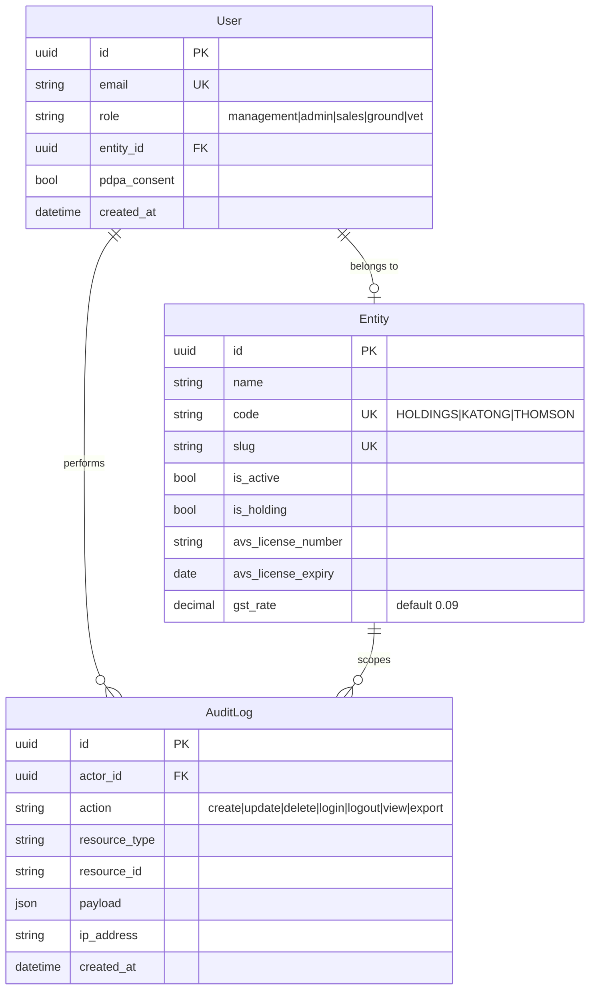

### 6.2 Operations Domain

```mermaid
erDiagram
    Dog {
        uuid id PK
        string microchip UK
        string name
        string breed
        date dob
        string gender "M|F"
        string colour
        uuid entity_id FK
        string status "ACTIVE|RETIRED|REHOMED|DECEASED"
        uuid dam_id FK "self-ref"
        uuid sire_id FK "self-ref"
        string unit
        string dna_status "PENDING|SUBMITTED|RESULTS_RECEIVED|EXCLUDED"
    }

    HealthRecord {
        uuid id PK
        uuid dog_id FK
        date date
        string category "VET_VISIT|TREATMENT|OBSERVATION|EMERGENCY"
        text description
        decimal temperature
        decimal weight
        bool follow_up_required
        date follow_up_date
    }

    Vaccination {
        uuid id PK
        uuid dog_id FK
        string vaccine_name
        date date_given
        date due_date "auto-calculated"
        string status "UP_TO_DATE|DUE_SOON|OVERDUE"
    }

    DogPhoto {
        uuid id PK
        uuid dog_id FK
        string url
        string category "PROFILE|HEALTH|BREEDING|GENERAL"
        bool customer_visible
    }

    InHeatLog {
        uuid id PK
        uuid dog_id FK
        int draminski_reading
        string mating_window "EARLY|RISING|FAST|PEAK|MATE_NOW"
    }

    MatedLog {
        uuid id PK
        uuid dog_id FK
        uuid sire_id FK
        string method "NATURAL|ASSISTED"
        uuid sire2_id FK "optional dual-sire"
    }

    WhelpedLog {
        uuid id PK
        uuid dog_id FK
        string method "NATURAL|C_SECTION"
        int alive_count
        int stillborn_count
    }

    WhelpedPup {
        uuid id PK
        uuid whelped_log_id FK
        uuid entity_id FK
        string gender "M|F"
        string colour
        decimal birth_weight
    }

    HealthObsLog {
        uuid id PK
        uuid dog_id FK
        string category "LIMPING|SKIN|NOT_EATING|EYE_EAR|INJURY|OTHER"
        text description
        decimal temperature
        decimal weight
        json photos
    }

    WeightLog {
        uuid id PK
        uuid dog_id FK
        decimal weight
    }

    NursingFlagLog {
        uuid id PK
        uuid dog_id FK
        string section "MUM|PUP"
        string flag_type "NO_MILK|REJECTING_PUP|PUP_NOT_FEEDING|OTHER"
        string severity "SERIOUS|MONITORING"
    }

    NotReadyLog {
        uuid id PK
        uuid dog_id FK
        text notes
        date expected_date
    }

    Entity {
        uuid id PK
    }

    Dog ||--o{ HealthRecord : "has"
    Dog ||--o{ Vaccination : "has"
    Dog ||--o{ DogPhoto : "has"
    Dog ||--o{ InHeatLog : "has"
    Dog ||--o{ MatedLog : "as dam"
    Dog ||--o{ MatedLog : "as sire"
    Dog ||--o{ WhelpedLog : "has"
    WhelpedLog ||--o{ WhelpedPup : "has"
    Dog ||--o{ HealthObsLog : "has"
    Dog ||--o{ WeightLog : "has"
    Dog ||--o{ NursingFlagLog : "has"
    Dog ||--o{ NotReadyLog : "has"
    Dog }o--o| Dog : "dam (mother)"
    Dog }o--o| Dog : "sire (father)"
    Dog }o--|| Entity : "belongs to"
```

### 6.3 Breeding & Genetics Domain

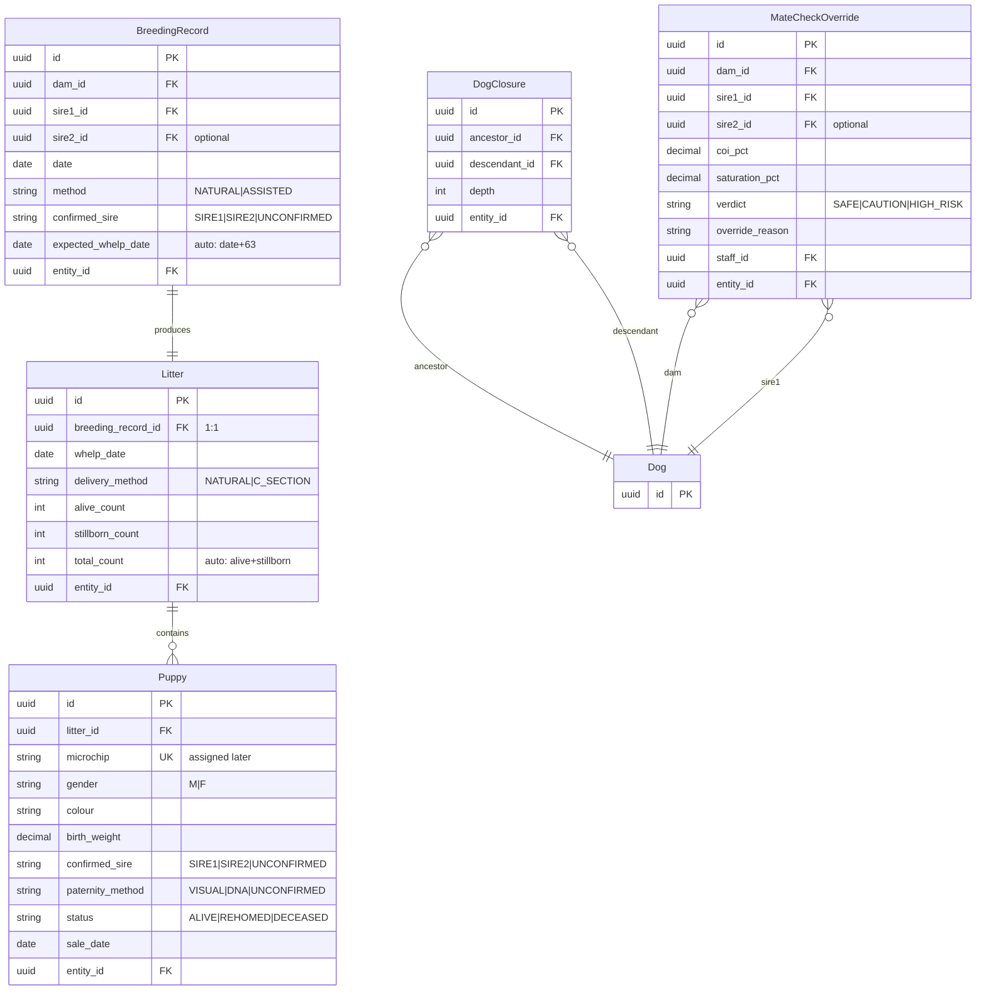

### 6.4 Sales & AVS Domain

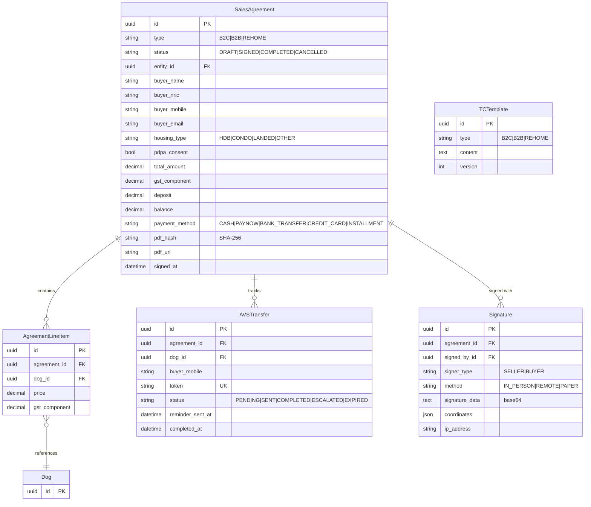

### 6.5 Compliance & Customer Domain

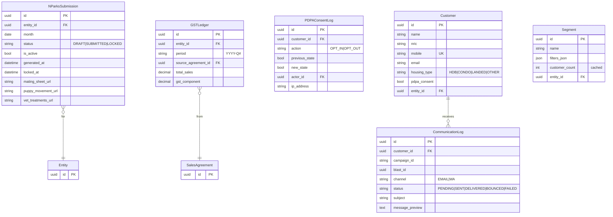

### 6.6 Finance Domain

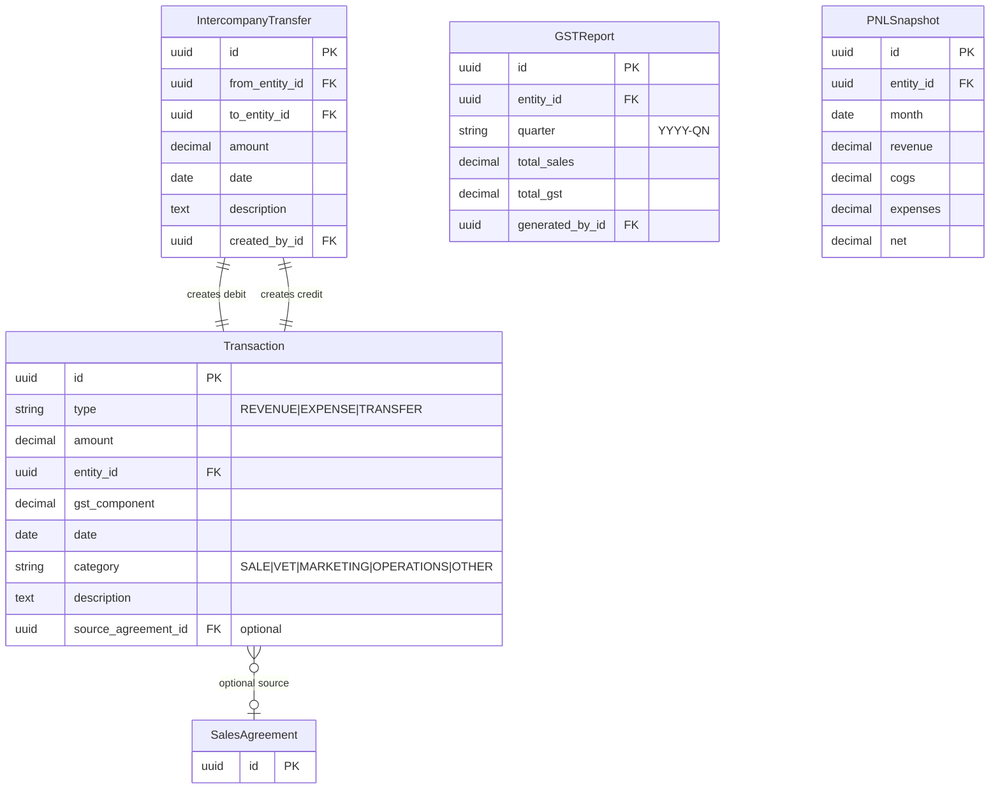

---

## 7. Application Flow Diagrams

### 7.1 Authentication Flow

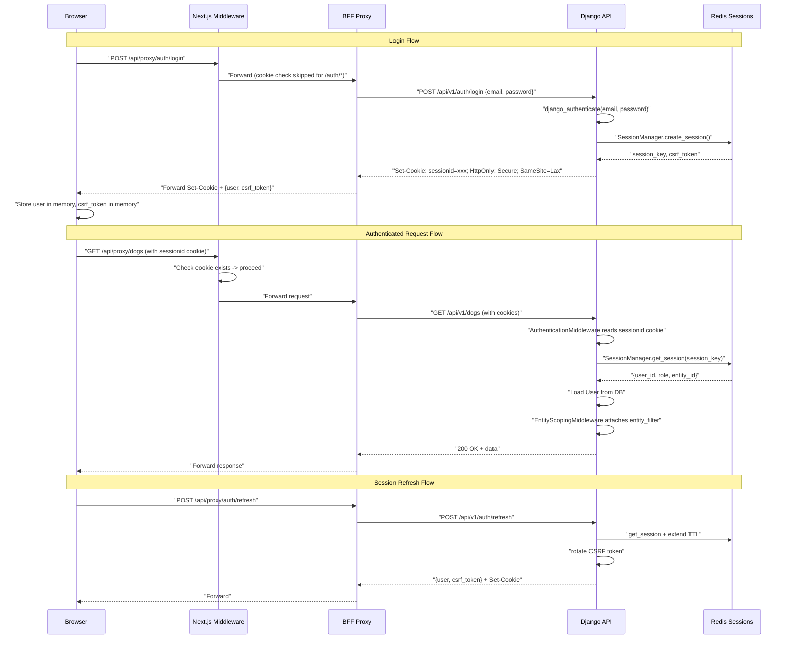

### 7.2 BFF Proxy Request Flow

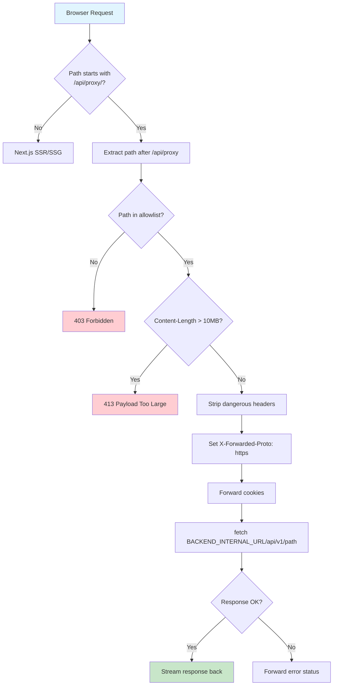

### 7.3 Idempotency Flow

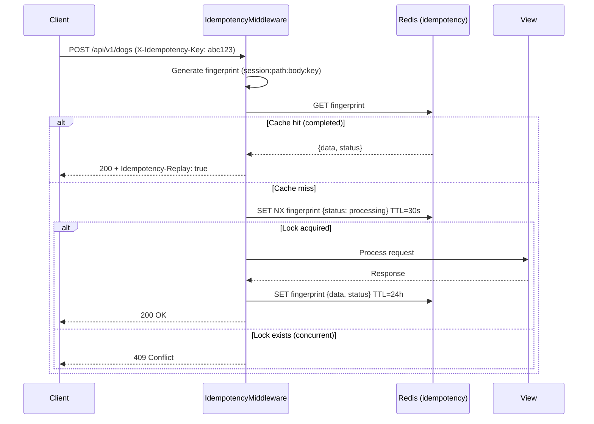

### 7.4 Ground Operations Offline Flow

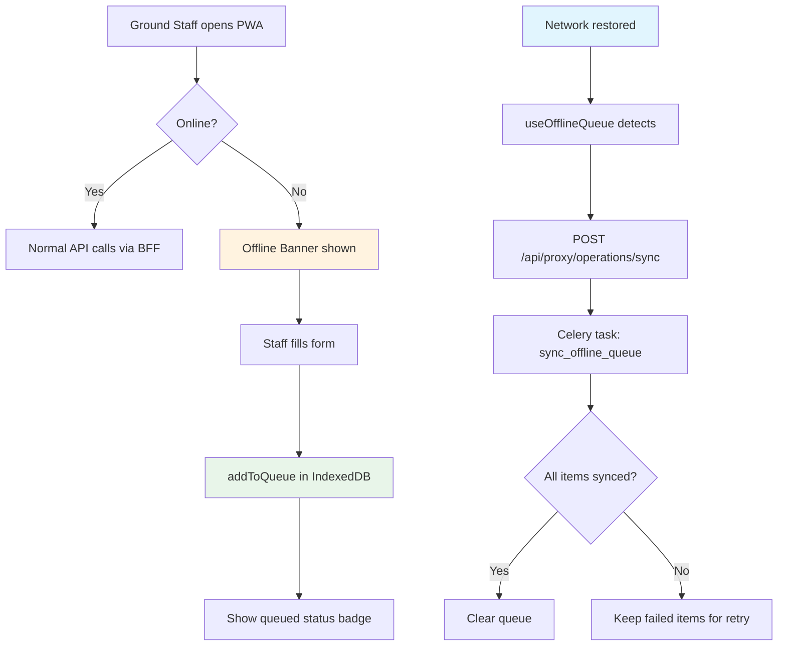

### 7.5 Celery Task Architecture

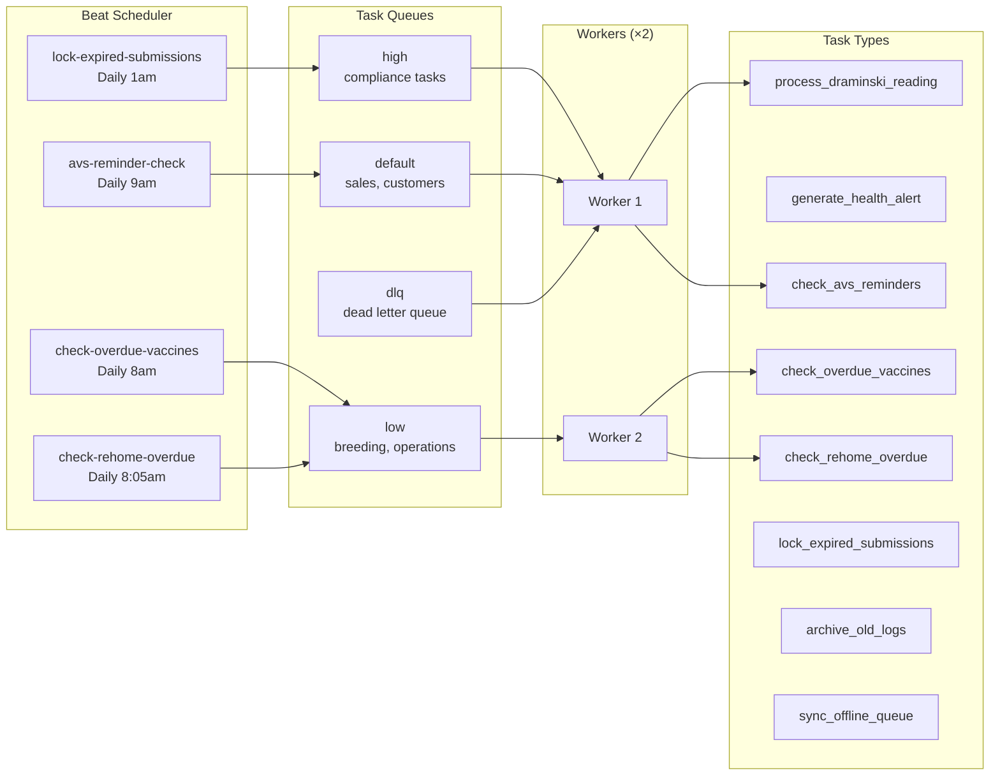

### 7.6 COI Calculation Flow

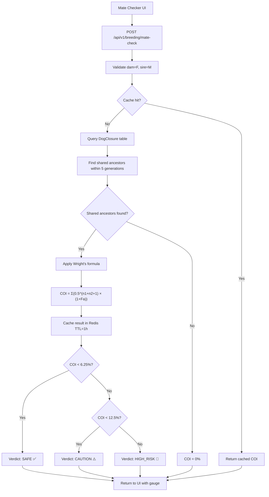

### 7.7 PWA Manifest & Service Worker

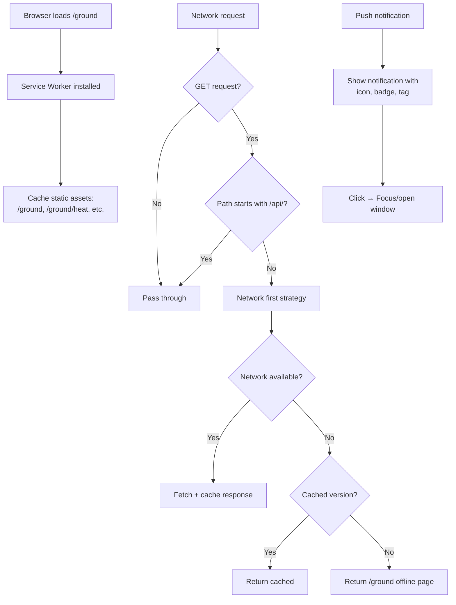

---

## 8. Backend Deep Dive

### 8.1 API Router Registration

All API routes are registered in `backend/api/__init__.py` on a single `NinjaAPI` instance:

| Prefix | Router | App | Purpose |
|--------|--------|-----|---------|
| `/auth` | `auth_router` | core | Login, logout, refresh, CSRF, me |
| `/dashboard` | `dashboard_router` | core | Dashboard metrics |
| `/users` | `users_router` | core | User CRUD |
| `/dogs` | `dogs_router` | operations | Dog CRUD + search |
| `/health` | `health_router` | operations | Health records + vaccinations |
| `/ground-logs` | `logs_router` | operations | 7 ground log types |
| `/alerts` | `alerts_router` | operations | Alert aggregation |
| `/stream` | `stream_router` | operations | SSE real-time alerts |
| `/breeding/mate-check` | `mating_router` | breeding | COI + saturation |
| `/breeding` | `litters_router` | breeding | Litter + puppy CRUD |
| `/sales` | `agreements_router` | sales | Agreement CRUD + PDF |
| `/avs` | `avs_router` | sales | AVS transfer tracking |
| `/compliance/nparks` | `nparks_router` | compliance | NParks submissions |
| `/compliance/gst` | `gst_router` | compliance | GST ledger |
| `/compliance/pdpa` | `pdpa_router` | compliance | PDPA consent |
| `/customers` | `customers_router` | customers | Customer CRUD + blast |
| `/finance` | `finance_router` | finance | P&L, GST reports |

### 8.2 Middleware Stack (Order Matters)

```python
MIDDLEWARE = [
    "SecurityMiddleware",           # HTTPS redirect, HSTS
    "CSPMiddleware",                # Content Security Policy
    "CorsMiddleware",               # CORS headers
    "SessionMiddleware",            # Django sessions (for admin)
    "CommonMiddleware",             # URL normalization
    "CsrfViewMiddleware",           # CSRF protection
    "AuthenticationMiddleware",     # Django auth (sets request.user)
    "apps.core.middleware.AuthenticationMiddleware",  # Custom Redis auth (re-authenticates)
    "MessageMiddleware",            # Flash messages
    "XFrameOptionsMiddleware",      # Clickjacking protection
    "IdempotencyMiddleware",        # Idempotency keys for state changes
    "EntityScopingMiddleware",      # Attach entity_filter to request
    "RatelimitMiddleware",          # Rate limit exception handling
]
```

### 8.3 Celery Beat Schedule

| Task | Schedule | Queue | Purpose |
|------|----------|-------|---------|
| `check_avs_reminders` | Daily 9:00 SGT | default | AVS transfer reminders |
| `check_overdue_vaccines` | Daily 8:00 SGT | low | Vaccine overdue alerts |
| `check_rehome_overdue` | Daily 8:05 SGT | low | Rehome age flags |
| `lock_expired_submissions` | Daily 1:00 SGT | high | Lock NParks submissions |

### 8.4 Redis Instance Layout

| Instance | Container | Memory | Eviction | Purpose |
|----------|-----------|--------|----------|---------|
| Sessions | `redis_sessions` | 128MB | allkeys-lru | Session storage |
| Broker | `redis_broker` | 256MB | noeviction | Celery task queue |
| Cache | `redis_cache` | 256MB | allkeys-lru | Django cache (COI, queries) |
| Idempotency | `redis_idempotency` | 128MB | allkeys-lru | Idempotency key storage |

---

## 9. Frontend Deep Dive

### 9.1 Route Structure

```
/login                    → Public (auth page)
/dashboard                → Protected (admin, management, sales)
/dogs                     → Protected (all roles)
/dogs/[id]                → Protected (all roles)
/breeding                 → Protected (admin, management)
/breeding/mate-checker    → Protected (admin, management)
/sales                    → Protected (sales, admin, management)
/sales/new                → Protected (sales, admin, management)
/compliance               → Protected (admin, management)
/customers                → Protected (sales, admin, management)
/finance                  → Protected (admin, management)
/ground                   → Ground ops (ground, admin, management)
/ground/heat              → Ground ops
/ground/mate              → Ground ops
/ground/whelp             → Ground ops
/ground/health            → Ground ops
/ground/weight            → Ground ops
/ground/nursing           → Ground ops
/ground/not-ready         → Ground ops
```

### 9.2 Data Fetching Pattern

All data fetching uses TanStack Query hooks that call the `api` client:

```typescript
// hooks/use-dogs.ts
export function useDogList(options) {
  return useQuery({
    queryKey: ['dogs', options],
    queryFn: () => api.get<DogListResponse>(`/dogs/?${params}`),
    staleTime: 30000,
  });
}
```

The `api` client (`lib/api.ts`):
- **Client-side:** Routes through BFF proxy (`/api/proxy/*`)
- **Server-side:** Direct to `BACKEND_INTERNAL_URL`
- Auto-attaches CSRF token from memory
- Auto-generates idempotency keys for mutations
- Auto-refreshes session on 401

### 9.3 Auth State Management

Auth state uses `useSyncExternalStore` for cross-component reactivity:

```
lib/auth.ts          → In-memory cache (cachedUser, cachedCsrfToken)
hooks/use-auth.ts    → React hooks (useCurrentUser, useIsAuthenticated, etc.)
components/layout/auth-initializer.tsx → Bootstrap on app load
```

**Key invariant:** No tokens in localStorage/sessionStorage. Session is HttpOnly cookie. CSRF token is in memory only. The `checkTokenLeakage()` function audits for violations.

### 9.4 Offline Queue Architecture

```
lib/offline-queue/
├── index.ts          → Auto-detecting adapter (IDB > localStorage > memory)
├── adapter.idb.ts    → IndexedDB (preferred, ~unlimited)
├── adapter.ls.ts     → localStorage (fallback, ~5MB)
├── adapter.memory.ts → In-memory (last resort)
├── db.ts             → IndexedDB connection management
└── types.ts          → OfflineQueueItem interface
```

---

## 10. Infrastructure & Deployment

### 10.1 Production Docker Compose (11 Services)

| Service | Image | Port | Network |
|---------|-------|------|---------|
| postgres | postgres:17-alpine | internal | backend_net |
| pgbouncer | edoburu/pgbouncer:1.23.0 | internal | backend_net |
| redis_sessions | redis:7.4-alpine | internal | backend_net |
| redis_broker | redis:7.4-alpine | internal | backend_net |
| redis_cache | redis:7.4-alpine | internal | backend_net |
| redis_idempotency | redis:7.4-alpine | internal | backend_net |
| django | Built from Dockerfile.django | internal | backend_net |
| celery_worker | Built from Dockerfile.django | internal | backend_net |
| celery_beat | Built from Dockerfile.django | internal | backend_net |
| gotenberg | gotenberg/gotenberg:8 | internal | backend_net |
| nextjs | Built from Dockerfile.nextjs | 3000 | frontend_net + backend_net |
| flower | mher/flower:2.0 | 5555 | backend_net |

### 10.2 CI/CD Pipeline

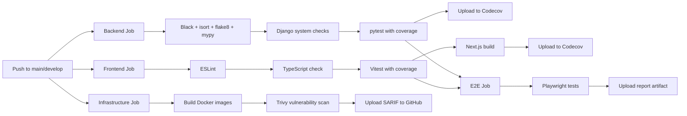

### 10.3 Environment Variables

**Required for production:**
- `DJANGO_SECRET_KEY` — No fallback, fails loud
- `DB_PASSWORD` — PostgreSQL password
- `REDIS_PASSWORD` — Redis authentication (see remediation plan)

**Key optional:**
- `STRIPE_SECRET_KEY` — Payment processing
- `SENTRY_DSN` — Error tracking
- `NEXT_PUBLIC_SENTRY_DSN` — Frontend error tracking
- `FLOWER_USER` / `FLOWER_PASSWORD` — Flower dashboard auth

---

## 11. Testing Strategy

### 11.1 Backend Tests

| Layer | Tool | Location | Coverage |
|-------|------|----------|----------|
| Unit | pytest + pytest-django | `apps/*/tests/` | Models, services, utils |
| Integration | pytest | `tests/` | API endpoints, auth flows |
| System | Django check | CI | Settings validation |

**Test count by app:**
- core: 16 test files (auth, permissions, middleware, CSP, settings)
- operations: 8 test files (dogs, alerts, importers, SSE, tasks)
- breeding: 6 test files (COI, saturation, models, PII)
- sales: 7 test files (agreements, AVS, GST, PDF)
- compliance: 5 test files (NParks, GST, PDPA)
- customers: 4 test files (blast, segmentation, mobile)
- finance: 5 test files (GST, PnL, transactions, entity access)

### 11.2 Frontend Tests

| Layer | Tool | Location | Coverage |
|-------|------|----------|----------|
| Unit | Vitest + Testing Library | `tests/`, `__tests__/` | Hooks, utils, components |
| E2E | Playwright | `e2e/` | Critical user flows |
| Type | TypeScript | — | Compile-time safety |

### 11.3 Infrastructure Tests

| Check | Tool | Where |
|-------|------|-------|
| Vulnerability scan | Trivy | CI pipeline (Django + Next.js images) |
| Lint | Black, isort, flake8, ESLint | CI pipeline |
| Type check | mypy, tsc | CI pipeline |

---

## 12. Security Model

### 12.1 Authentication

- **Mechanism:** HttpOnly cookie (`sessionid`) + Redis session store
- **Session TTL:** 15 minutes (access), 7 days (refresh)
- **CSRF:** Token-based, rotated on login/refresh
- **Password:** Django's built-in validators (similarity, length, common, numeric)

### 12.2 Authorization

- **RBAC:** 5 roles (management > admin > sales > ground = vet)
- **Entity scoping:** Automatic query filtering by user's entity
- **PDPA:** Hard filter on `pdpa_consent=True` for models with that field

### 12.3 Transport Security

- **TLS:** Nginx terminates HTTPS (production)
- **HSTS:** 1 year, includeSubDomains, preload
- **CSP:** Enforced in production, report-only in dev
- **Cookies:** HttpOnly, Secure (prod), SameSite=Lax

### 12.4 API Security

- **Rate limiting:** django-ratelimit (login: 5/min, refresh: 10/min, CSRF: 20/min)
- **Idempotency:** Required for all state-changing operations
- **CORS:** Restricted origins (wellfond.sg, localhost:3000)
- **Input validation:** Pydantic schemas via Django Ninja
- **Path traversal:** BFF proxy validates allowed paths, rejects `..` and null bytes

---

## 13. Development Workflow

### 13.1 Local Setup

```bash
# 1. Clone and configure
cp .env.example .env
# Edit .env with your values

# 2. Start infrastructure (hybrid mode)
cd infra/docker
docker compose up -d postgres redis

# 3. Backend
cd backend
python -m venv venv && source venv/bin/activate
pip install -r requirements/dev.txt
python manage.py migrate
python manage.py runserver

# 4. Frontend
cd frontend
npm install
npm run dev

# 5. Celery (optional)
cd backend
celery -A config worker -l info -Q high,default,low,dlq
celery -A config beat -l info
```

### 13.2 Making Changes

**Adding a new domain model:**
1. Create model in `apps/<domain>/models.py`
2. Create migration: `python manage.py makemigrations`
3. Create Pydantic schema in `apps/<domain>/schemas.py`
4. Create router in `apps/<domain>/routers/`
5. Register router in `api/__init__.py`
6. Create frontend hook in `hooks/use-<domain>.ts`
7. Create frontend types in `lib/types.ts`
8. Write tests in both `apps/<domain>/tests/` and `frontend/tests/`

**Adding a new API endpoint:**
1. Add to the appropriate router in `apps/<domain>/routers/`
2. Use `@require_role()` decorator for RBAC
3. Use `scope_entity()` for entity filtering
4. Add Pydantic schema for request/response
5. Frontend: add to appropriate hook

### 13.3 Code Conventions

**Backend:**
- Django Ninja for API (not DRF)
- Pydantic schemas for validation
- `scope_entity()` for all queries
- `ImmutableManager` for append-only models
- Structured JSON logging in production

**Frontend:**
- TanStack Query for server state
- `useSyncExternalStore` for auth state
- BFF proxy for all API calls (never direct to Django)
- Radix UI primitives + Tailwind for styling
- `sonner` for toast notifications

---

## 14. Key Files Reference

### Must-Read Files for New Developers

| File | Why |
|------|-----|
| `backend/apps/core/models.py` | User, Entity, AuditLog — foundation of everything |
| `backend/apps/core/auth.py` | How authentication actually works |
| `backend/apps/core/permissions.py` | RBAC + entity scoping — read before writing any view |
| `backend/apps/core/middleware.py` | Idempotency + entity scoping middleware |
| `backend/api/__init__.py` | All API router registration — the API "table of contents" |
| `backend/config/settings/base.py` | All shared Django settings |
| `frontend/lib/api.ts` | How the frontend talks to the backend |
| `frontend/lib/auth.ts` | Client-side auth model |
| `frontend/hooks/use-auth.ts` | React auth hooks |
| `frontend/app/api/proxy/[...path]/route.ts` | BFF proxy — the bridge between frontend and backend |
| `frontend/lib/types.ts` | All TypeScript type definitions |
| `docker-compose.yml` | Production service topology |

### Files to Never Commit

| Pattern | Reason |
|---------|--------|
| `.env` | Contains real secrets |
| `.env.bak` | Contains dev secrets |
| `infra/docker/nginx/certs/*.key` | TLS private key |
| `*.pem`, `*.crt` | Certificates |

---

## 15. Glossary

| Term | Definition |
|------|-----------|
| **AVS** | Animal & Veterinary Service (Singapore) — licensing authority |
| **BFF** | Backend-for-Frontend — Next.js proxy pattern |
| **COI** | Coefficient of Inbreeding — genetic diversity metric |
| **Draminski** | DOD2 conductivity meter for heat cycle detection |
| **GST** | Goods & Services Tax (9% in Singapore) |
| **HDB** | Housing Development Board — Singapore public housing |
| **NParks** | National Parks Board — monthly breeding reports |
| **NRIC** | National Registration Identity Card (Singapore) |
| **PDPA** | Personal Data Protection Act (Singapore) |
| **PgBouncer** | PostgreSQL connection pooler (transaction mode) |
| **RBAC** | Role-Based Access Control |
| **SSE** | Server-Sent Events — real-time alert streaming |
| **WAL** | Write-Ahead Logging (PostgreSQL replication) |
